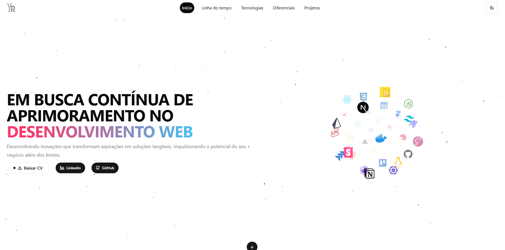
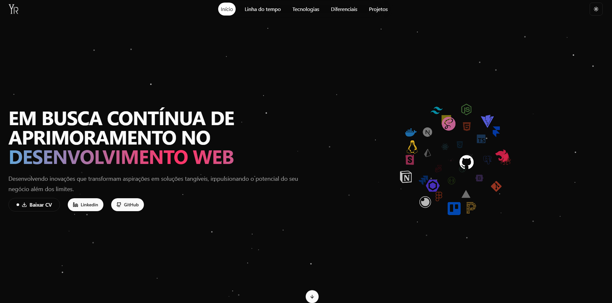

# 📌 Meu Portfólio

## 🖥️ Sobre o Projeto
Este é o meu **portfólio pessoal**, desenvolvido para exibir minha trajetória profissional e acadêmica, além dos projetos mais recentes que venho desenvolvendo. Ele foi pensado para ser **totalmente responsivo**, garantindo uma navegação fluida tanto em desktops quanto em dispositivos móveis.

O principal objetivo desse projeto foi consolidar e aplicar meus conhecimentos adquiridos em tecnologias modernas, além de otimizar a experiência do usuário com um design dinâmico e intuitivo.

## 🚀 Tecnologias Utilizadas
Para desenvolver este portfólio, utilizei as seguintes tecnologias e ferramentas:

- **[Next.js](https://nextjs.org/)** → Framework React para renderização no servidor (SSR) e geração de páginas estáticas (SSG), proporcionando alto desempenho e otimização para SEO.
- **[Framer Motion](https://www.framer.com/motion/)** → Biblioteca poderosa para criar animações suaves e interativas.
- **[TypeScript](https://www.typescriptlang.org/)** → Superset do JavaScript que adiciona tipagem estática, tornando o código mais seguro e escalável.
- **[Tailwind CSS](https://tailwindcss.com/)** → Framework de estilização baseado em classes utilitárias, garantindo maior produtividade e modularidade.
- **[NextThemes](https://github.com/pacocoursey/next-themes)** → Gerenciamento de temas claro/escuro de forma dinâmica e intuitiva.
- **[Vercel](https://vercel.com/)** → Plataforma utilizada para o deploy do projeto, garantindo alta performance e facilidade na hospedagem.

## 🔥 Recursos e Funcionalidades
✅ **Timeline profissional e acadêmica** → Exibição organizada das minhas experiências e formação.
✅ **Demonstração de projetos** → Lista dos projetos mais relevantes que desenvolvi, com links diretos.
✅ **Tema Claro/Escuro** → Alterne entre os temas para melhor conforto visual.
✅ **Animações dinâmicas** → Suavidade nas transições e interações.
✅ **Responsividade completa** → Adaptado para telas de qualquer tamanho.
✅ **SEO otimizado** → Melhor posicionamento nos motores de busca.

## 📸 Screenshots
### 🌞 Tema Claro


### 🌙 Tema Escuro


## 📦 Como Rodar o Projeto Localmente
Caso queira rodar o projeto na sua máquina, siga os passos abaixo:

### 1️⃣ Clone o repositório
```sh
 git clone https://github.com/YuriLRodrigues/portfolio.yuri.dev
```

### 2️⃣ Instale as dependências
```sh
 npm install
```

### 4️⃣ Rode o servidor de desenvolvimento
```sh
 npm run dev
```

O projeto estará disponível em `http://localhost:3000` 🚀

## 🌍 Deploy
O projeto está hospedado na **Vercel** e pode ser acessado pelo link abaixo:

🔗 **[Acesse o Portfólio](https://yuridev.vercel.app/)**

## 🤝 Contribuição
Se tiver alguma sugestão ou feedback, fique à vontade para abrir uma **issue** ou me chamar no [LinkedIn](https://www.linkedin.com/in/yuri-leite-rodrigues/). Toda ajuda é bem-vinda! 🚀

---

Feito com 💙 por **[Yuri Leite Rodrigues](https://github.com/YuriLRodrigues/)**
